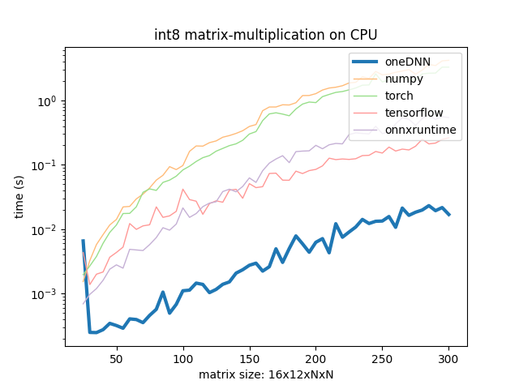

# numpy-int-ops

Fast integer operations on CPUs for numpy.

Supported Ops:

 - `int8 x int8 -> int32` matrix multiplication for 4-dimensional arrays



## Installation

The following instructions are tested on Fedora 37.

 1. Build oneDNN from source. We do that in an Ubuntu22.04 container like in the oneDNN CI.
    ```bash
    cd onednn_int_ops

    # Create a ubuntu container with gcc and cmake
    podman build -t ubuntu-build .
    # Build oneDNN in container
    podman run -v "$PWD":"$PWD":z ubuntu-build bash -c "cd $PWD && bash container_build_onednn.sh"
    # Install oneDNN to install
    podman run -v "$PWD":"$PWD":z ubuntu-build bash -c "cd $PWD && bash container_install_onednn.sh"
    ```
 
 2. Create shared library for fast integer operations and copy it into the root
    directory of the python package. 
    ```bash
    cd onednn_int_ops

    mkdir -p build && cd build
    cmake .. && make
    cp libIntOps.so ../../numpy_int_ops/.
    ```

 3. Install python package
    ```bash
    pip install .
    ```

 4. Test the installation
    ```bash
    python - <<'EOF'
    import numpy as np
    from numpy_int_ops_cpu.ops import int8_matmul
    A = np.arange(4).reshape(1, 1, 2, 2).astype(np.int8)
    B = (np.arange(4) - 2).reshape(1, 1, 2, 2).astype(np.int8)
    print(int8_matmul(A, B).reshape(2, 2))
    EOF
    ```
## Benchmark

To benchmark the implementation, run 

```bash
cd benchmark
python3.10 -m venv venv
source venv/bin/activate
pip install torch torchvision torchaudio --extra-index-url https://download.pytorch.org/whl/cpu
pip install ..
pip install -r requirements.txt
python matmatmul.py
```